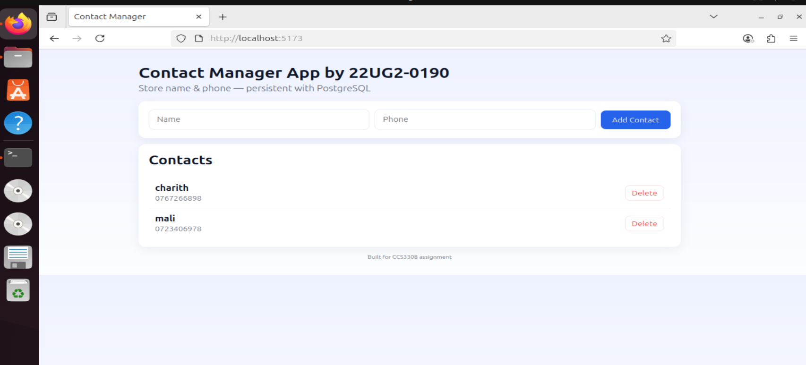

# A simple contact manager App

overview: a basic contact manager webapp, with the capbaility
to add new contacts with name and remove existing contacts.



3 services - frontend/backend/database
db - has persistent volume. 

its location:

"Mountpoint": "/var/lib/docker/volumes/contact_db_data/_data",
        "Name": "contact_db_data",

## Deployment Requirements
For the purpose of deploying this application, you will need:
- **Ubuntu** (or any Linux distribution with Docker installed)
- **Docker** (version 20+ recommended)
- **Docker Compose** (version 2+ recommended)
- **Git** (to clone the repository)
- **Web Browser** (Chrome, Firefox, Edge, etc.)

## Application Description
This is a **Basic Contact Manager** web application that allows users to:
- Add contacts (name and phone number)
- View stored contacts
- Data is stored persistently in a PostgreSQL database, even if the app is stopped or restarted.

The application is made of:
- **Frontend**: A Vite.js-based web interface for users.
- **Backend**: A Node.js REST API for handling requests.
- **Database**: PostgreSQL for storing contacts.

## Network and Volume Details
- **Network**: `contactapp_network`  
  Used for communication between the frontend, backend, and database containers.
- **Volume**: `contactapp_data`  
  Stores PostgreSQL data so that it persists even after container restarts.
  -"Mountpoint": "/var/lib/docker/volumes/contact_db_data/_data", "Name": "contact_db_data",

## Container Configuration
1. **Frontend Container**  
   - Based on Node.js 18 image. (built from ./frontend folder)  
   - Runs on port 3000.  

2. **Backend Container**  
   - Based on Node.js 18 image. (built from ./backend folder)  
   - Run on port 5000. 

3. **Database Container**  
   - Based on `postgres:13` image.  
   - Initializes with `init.sql` to create required tables.  
  
## Container List
| Container Name            | Role            | Port Mapping        |
|---------------------------|-----------------|---------------------|
| contactapp-frontend       | Frontend UI     | 3000:3000           |
| contactapp-backend        | Backend API     | 5000:5000           |
| contactapp-db             | Database        | 5432 (internal only)|

## Instructions

First clone the github to your respective PC.
cd into the folder.

1. To make all the scripts executable
```bash
chmod +x prepare-app.sh start-app.sh stop-app.sh remove-app.sh 
```
2. To prepare the app (creates network and volume and builds images)
```bash
./prepare-app.sh
```
*make sure the given ports are available on your PC, without any other application using it. 

3. To start and run the app
```bash
./start-app.sh
```
4. This will then give localhost link to access web app as:

Frontend: http://localhost:5173

Backend API: http://localhost:3000/api/contacts

5. To stop the app
```bash
./stop-app.sh
```
6. To remove all resources allocated for the application
```bash
./remove-app.sh
```


